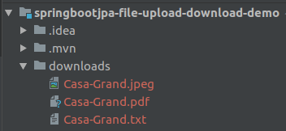

# springbootjpa-file-upload-download-demo
This project explains do file upload and download using spring boot jpa

### application.properties
```
   spring.datasource.driver-class-name=com.mysql.jdbc.Driver
   spring.datasource.url = jdbc:mysql://localhost:3306/Student?useSSL=false
   spring.datasource.username=root
   spring.datasource.password=root
   spring.jpa.hibernate.ddl-auto=update
   spring.jpa.properties.hibernate.dialect=org.hibernate.dialect.MySQL5Dialect
   spring.jpa.properties.hibernate.format_sql=true
   spring.jpa.show-sql=true
   server.port=8082

```
**Note:**
_Set  the below one in application.properties if you use postgresql otherwise you will get an error 
spring.jpa.hibernate.temp.use_jdbc_metadata_defaults=false_

### FileUpload.java

```
@Entity
@Table(name = "house")
public class FileUpload {

    @Id
    @Column(name = "house_id")
    private Long houseId;

    @Column(name = "house_name")
    private String houseName;

    @Column(name = "house_type")
    private String houseType;

    @Lob
    @Column(name = "house_images")
    private byte[] images;

```
### FileUploadRepository.java

```
public interface FileUploadRepository extends JpaRepository<FileUpload, Long> {
}

```

### SpringbootjpaFileUploadDownloadDemoApplication.java

```
@SpringBootApplication
public class SpringbootjpaFileUploadDownloadDemoApplication implements CommandLineRunner {

	@Autowired
	FileUploadRepository fileUploadRepository;

	public static void main(String[] args) {
		SpringApplication.run(SpringbootjpaFileUploadDownloadDemoApplication.class, args);
	}

	@Override
	public void run(String... args) throws Exception {

		ClassPathResource forImage = new ClassPathResource("static/attachments/pic-1.jpeg");
		byte[] content1 = new byte[(int) forImage.contentLength()];
		forImage.getInputStream().read(content1);
		FileUpload upload1 = new FileUpload(1L,"Casa-Grand", "jpeg", content1);

		ClassPathResource forDoc = new ClassPathResource("static/attachments/home.txt");
		byte[] content2 = new byte[(int) forDoc.contentLength()];
		forDoc.getInputStream().read(content2);
		FileUpload upload2 = new FileUpload(2L,"Casa-Grand", "txt", content2);

		ClassPathResource forPdf = new ClassPathResource("static/attachments/layout.pdf");
		byte[] content3 = new byte[(int) forPdf.contentLength()];
		forPdf.getInputStream().read(content3);
		FileUpload upload3 = new FileUpload(3L,"Casa-Grand", "pdf", content3);

		//store files
		fileUploadRepository.saveAll(Arrays.asList(upload1, upload2, upload3));

		//retrieve files
		for (FileUpload upload: fileUploadRepository.findAll()) {
			Files.write(Paths.get("downloads/" + upload.getHouseName() + "." + upload.getHouseType()), upload.getImages());
		}

	}

```

### Output

**Stored in DB**


**Download from DB**




### Happy Coding


